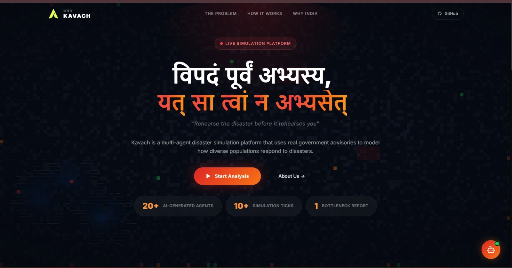
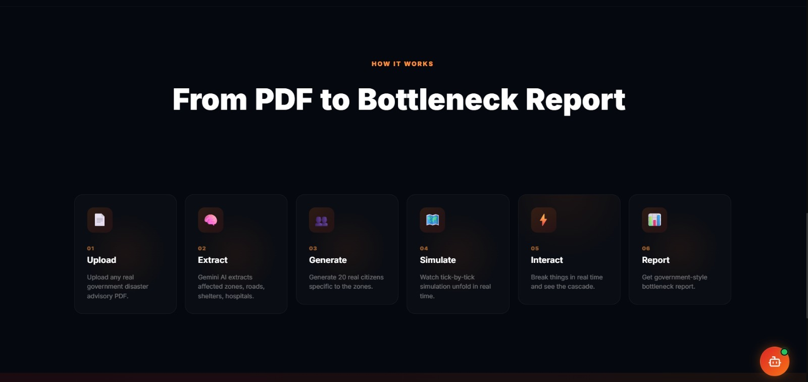
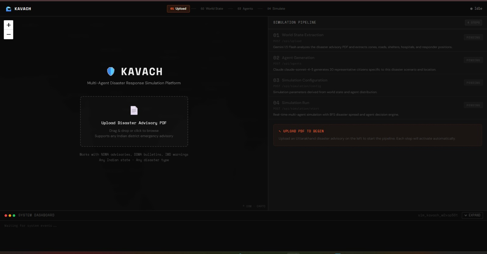
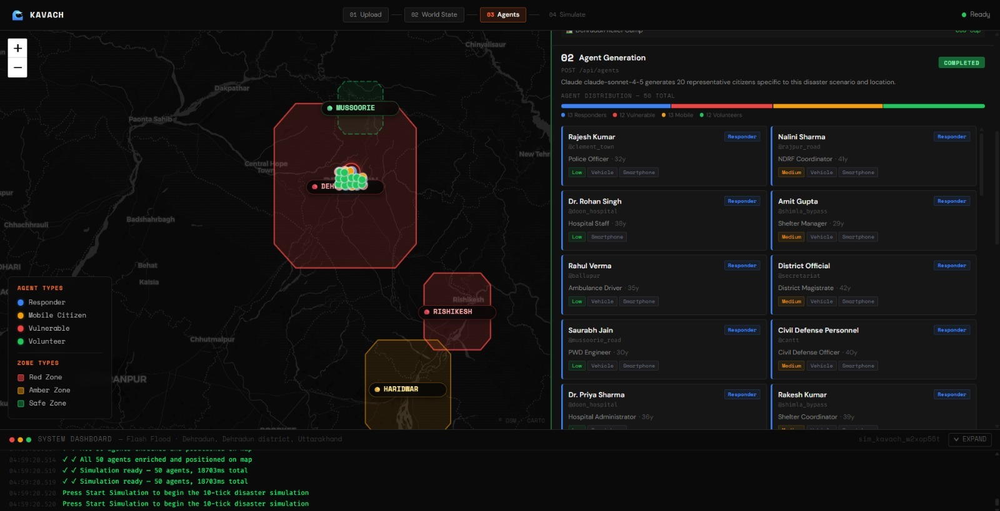
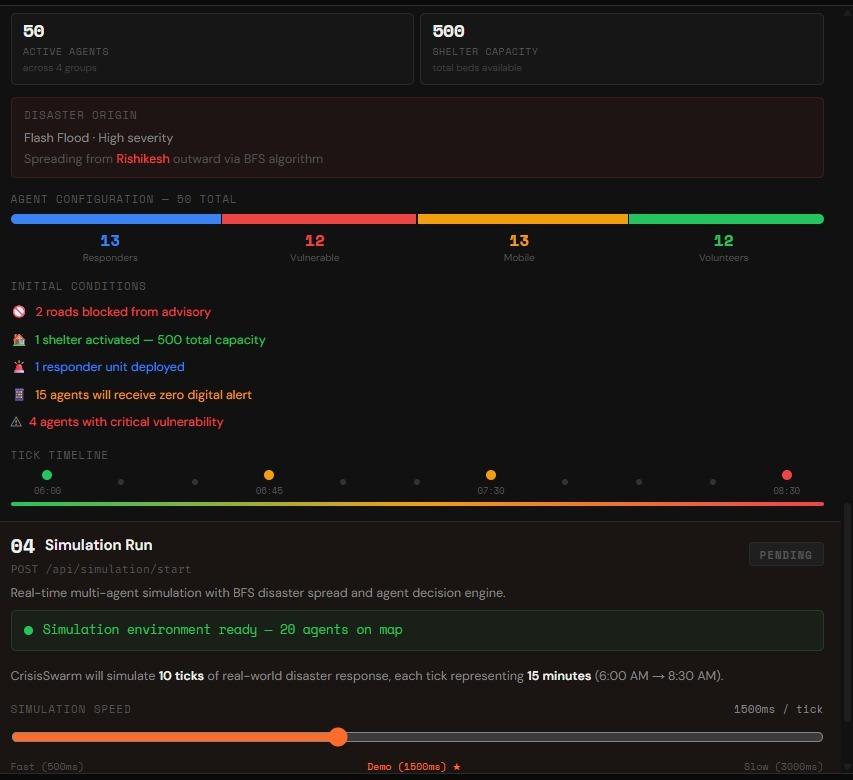

# KAVACH — कवच
### *Autonomous Multi-Agent Disaster Orchestration & Crisis Response Intelligence Platform*

<br/>

> **"When every second is a life — Kavach simulates the chaos so responders don't have to face it unprepared."**

<br/>

[](https://manipal.edu)
[](https://ieee.org)
[](/)
[](/)

<br/>

[](https://react.dev)
[](https://nodejs.org)
[](https://leafletjs.com)
[](https://anthropic.com)
[](https://deepmind.google)
[](https://groq.com)


<br/>

[Watch Demo](#-video-demo) · [Quick Start](#-quick-start) · [Live Demo](#-live-demo) · [Architecture](#-folder-structure)

---

## Live Demo

> **Deployed Application:** [Kavach Live Link](https://kavach-frontend-two.vercel.app/)

 - Use the advisary report from the docs (uttarakhand_flood_advisory_2024.pdf) folder to upload and test the project.
 - You can also download the advisary report from the link (https://drive.google.com/file/d/1q1E4lZ16otUkySWdbuSKTc_FtsQEmfTj/view?usp=sharing)

---

## Video Demo

> **Full Walkthrough:** [Google Drive Link](https://drive.google.com/file/d/1SR6kCl1LCJgnDndEsoEgXfX0Yq_SHl23/view?usp=sharing)

---

## PPT Link

> **Complete PPT Link** (https://docs.google.com/presentation/d/1MrdJAUUUdn8klDAlr51mPfl2dtBMJu4j/edit?usp=sharing&ouid=108591759035325009224&rtpof=true&sd=true)

---

## Screenshots

### Landing Page



### Upload Page 


### Agent Generation and Distribution


### Tick Image



---

## What is Kavach?

**Kavach** is a **heterogeneous multi-agent disaster simulation and emergency response coordination platform** built for real-world disaster preparedness in India.

Powered by a **tripartite LLM orchestration layer** (Claude + Gemini + Groq), Kavach ingests raw disaster advisory PDFs and autonomously constructs a living, breathing simulation — complete with 50 intelligent citizen agents, a BFS-driven disaster propagation engine, and a real-time geospatial visualization on an actual Leaflet map of the affected region.

Unlike traditional disaster management tools that rely on static heatmaps and manual data entry, Kavach operationalizes **emergent agent behavior** — each agent thinks, reacts, and adapts based on their unique socioeconomic profile, physical capability, and real-time environmental feedback.

Example: A pregnant farmer in a red zone does not make the same decisions as an NDRF coordinator in a safe zone. That asymmetry is the simulation.

**This is not a proof-of-concept. This is a command center.**

---

## The Problem We're Solving

Disaster response agencies lack the tools to rapidly model:
- How a flood will propagate through a specific road network
- Which population segments will be unreachable within the first 3 ticks (45 minutes)
- Where coordination bottlenecks will emerge *before* they occur
- What the quantifiable readiness score of a zone is, right now

Kavach solves for all four — in under 60 seconds from PDF upload.

---

## Folder Structure

```
kavach/
├── frontend/
│   ├── src/
│   │   ├── pages/
│   │   │   └── SimulationPage.jsx
│   │   ├── components/
│   │   │   ├── layout/
│   │   │   │   ├── TopNav.jsx
│   │   │   │   └── SystemDashboard.jsx
│   │   │   ├── map/
│   │   │   │   ├── MapView.jsx
│   │   │   │   └── AgentCanvas.jsx
│   │   │   ├── pipeline/
│   │   │   │   ├── PipelinePanel.jsx
│   │   │   │   ├── StepCard.jsx
│   │   │   │   ├── WorldStateStep.jsx
│   │   │   │   ├── AgentGenStep.jsx
│   │   │   │   ├── SimConfigStep.jsx
│   │   │   │   └── SimRunStep.jsx
│   │   │   ├── agents/
│   │   │   │   ├── AgentCard.jsx
│   │   │   │   └── AgentGrid.jsx
│   │   │   ├── simulation/
│   │   │   │   ├── WhatIfPanel.jsx
│   │   │   │   ├── TickCounter.jsx
│   │   │   │   └── StatsBar.jsx
│   │   │   └── report/
│   │   │       ├── ReportPanel.jsx
│   │   │       └── VerdictSection.jsx
│   │   ├── hooks/
│   │   │   ├── useSocket.js
│   │   │   └── useSimulation.js
│   │   ├── utils/
│   │   │   ├── agentColors.js
│   │   │   └── formatLog.js
│   │   ├── context/
│   │   │   └── SimulationContext.jsx
│   │   └── App.jsx
├── backend/
│   ├── routes/
│   │   └── upload.js
│   ├── services/
│   │   ├── pdfParser.js
│   │   ├── geminiService.js
│   │   ├── claudeService.js
│   │   └── groqService.js
│   ├── simulation/
│   │   ├── cityGraph.js
│   │   ├── floodEngine.js
│   │   ├── agentEngine.js
│   │   ├── needsEngine.js
│   │   └── tickLoop.js
│   ├── prompts/
│   │   ├── worldStatePrompt.js
│   │   ├── agentGenerationPrompt.js
│   │   ├── reportPrompt.js
│   │   └── verdictPrompt.js
│   └── index.js
├── screenshots/
├── .env
└── package.json
```

---

## Technology Stack

### Frontend
| Technology | Version | Role |
|---|---|---|
| **React** | 19.x | UI component framework |
| **Vite** | 8.x | Build tooling & HMR dev server |
| **React-Leaflet** | Latest | Geospatial map rendering |
| **Canvas API** | Native | Agent dot overlay (positioned absolute over Leaflet) |
| **Socket.io-client** | Latest | Real-time WebSocket event consumption |
| **Axios** | Latest | REST API communication |
| **React Context** | Built-in | Global simulation state (no Redux/Zustand) |

### Backend
| Technology | Version | Role |
|---|---|---|
| **Node.js + Express** | 5.x | HTTP server & API routing |
| **Socket.io** | Latest | Bidirectional WebSocket server |
| **Multer** | Latest | PDF file ingestion (memory storage) |
| **pdf-parse** | Latest | Raw text extraction from advisory PDFs |
| **dotenv** | Latest | Environment variable management |
| **cors** | Latest | Cross-origin request handling |

### AI / LLM Layer
| Model | Provider | Usage |
|---|---|---|
| **claude-sonnet-4-5** | Anthropic | Agent persona generation |
| **gemini-1.5-flash** | Google DeepMind | World state extraction + report synthesis |
| **llama-3.1** via Groq | Meta / Groq | Fallback for all LLM operations |

### Infrastructure
| Component | Technology |
|---|---|
| Map tiles | OpenStreetMap (free, no API key) |
| Transport | WebSockets via Socket.io |
| Storage | None (stateless, in-memory only) |
| Auth | None (localhost-first architecture) |

---

## Quick Start

### Prerequisites

- **Node.js** 18+ — [nodejs.org](https://nodejs.org)
- **npm** 9+
- API keys for **Claude**, **Gemini**, and **Groq**

### Step 1 — Clone

```bash
git clone https://github.com/codewith-raj/3x-Devs
cd Project
```

### Step 2 — Configure Environment

Create `.env` in the `backend/` directory:

```env
# ── LLM Keys ──────────────────────────────────────
CLAUDE_API_KEY=sk-ant-...
GEMINI_API_KEY=AIza...
GROQ_API_KEY=gsk_...

# ── Server ────────────────────────────────────────
PORT=5000
NODE_ENV=development
```

Create `.env` in the `frontend/` directory:

```env
VITE_BACKEND_URL=http://localhost:5000
```

### Step 3 — Install & Launch Backend

```bash
cd backend
npm install
npm nodemon --service-dev
npm run dev
```

Expected output:
```
[Kavach] Server running on http://localhost:5000
[Socket.io] WebSocket transport initialized
[LLM] Claude   Gemini   Groq 
```

### Step 4 — Install & Launch Frontend

```bash
# Open a new terminal
cd frontend
npm install
npm run dev
```

Expected output:
```
  VITE  ready in 312ms
  ➜  Local:   http://localhost:5173/
```

### Step 5 — Run Your First Simulation

1. Navigate to `http://localhost:5173`
2. Click on **Analyze Now**
3. Upload a disaster advisory PDF 
4. Watch Gemini extract the world state in real time
5. Watch Claude generate 50 contextually grounded citizen agents
6. Scroll down and hit **Start Simulation** — the map comes alive
7. Trigger a What-If scenario at Tick 6
8. Read the Final Verdict with readiness score

---

## Agent Architecture

Every agent generated by the AI model is a **behaviorally distinct simulation entity**. Below is the canonical agent schema:

```json
{
  "id": "agent_07",
  "name": "Rekha Devi",
  "handle": "@Chamoli_RedZone",
  "role": "vulnerable_civilian",
  "group": "red",
  "age": 28,
  "occupation": "Farmer",
  "location": { "zone": "red", "area": "Gopeshwar", "lat": 30.387, "lng": 79.404 },
  "backstory": "A 28-year-old farmer in Gopeshwar with no vehicle and no smartphone, 8 months pregnant, unable to self-evacuate without external coordination.",
  "hasVehicle": false,
  "hasSmartphone": false,
  "vulnerabilityLevel": "critical",
  "initialThought": "The water is rising. I cannot move on my own. I need help.",
  "status": "trapped",
  "currentThought": "Route blocked since tick 3. Waiting for ambulance.",
  "speed": 0.3,
  "rescuePriority": 0.95
}
```

Agent groups map to visual dot colors on the Leaflet canvas:

| Group | Color | Typical Role |
|---|---|---|
| `responder` | Blue |  NDRF, coordinators, paramedics |
| `vulnerable` |  Red |  Elderly, pregnant, disabled, isolated |
| `mobile_civilian` |  Amber |  Citizens capable of self-evacuation |
| `volunteer` |  Green | NGO workers, local guides, volunteers |

---

##  Team

**3x-Devs** — Hackerz Street 4.0 @ Manipal University Jaipur

| Name |Github Profile|
|---|---|
| Ritik Raj |codewith-raj |
| Vikram Singh Gangwar | vikram-codes-hub |
| Veer Jain | vjn6805 |


---

## Acknowledgements

- **Anthropic** — For Claude's unmatched agent persona generation capability
- **Google DeepMind** — For Gemini's rapid document intelligence
- **Groq** — For near-zero-latency open-source inference
- **OpenStreetMap** — For free, accurate cartographic data
- **IEEE Computer Society, MUJ** — For creating the platform that demanded this project

---


<div align="center">

**KAVACH — कवच**

*Built for Hackerz Street 4.0 · IEEE Computer Society · Manipal University Jaipur*

*Domain: Disaster Management · Problem Statement 04*

<br/>

> *"The best disaster response is the one that was rehearsed."*

</div># KAVACH
